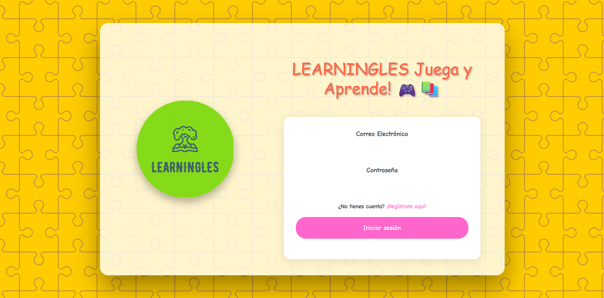
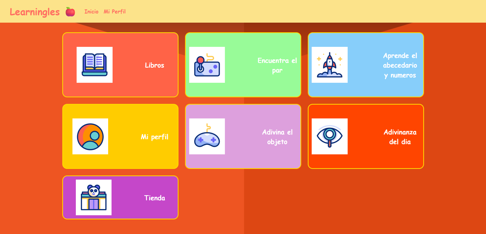
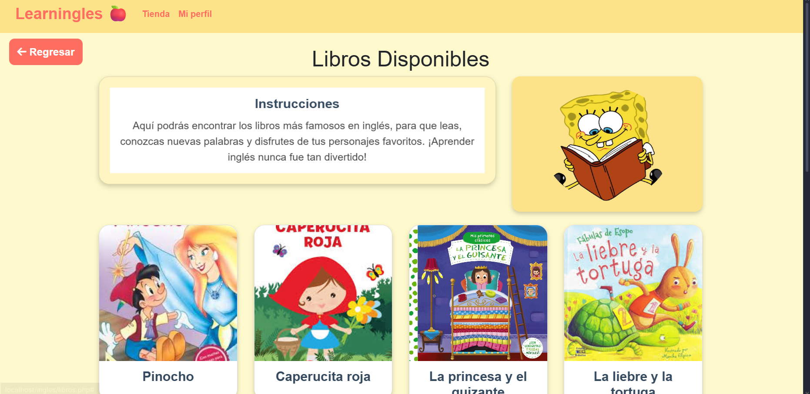

# English Learning Platform for Kids

 **University / Academic Project**

This project was developed as part of my university studies.  
It is a **local environment project** and was created for learning and academic purposes.

---

##  Objectives

The main objective of this project is to **create an interactive platform for children to learn English**, applying fundamental concepts of web development and software engineering, such as:

- Web programming fundamentals
- CRUD operations (Create, Read, Update, Delete)
- Database creation and usage with MySQL
- Frontend and backend integration
- Basic system logic for educational platforms

---

## Project Description

The system consists of an **English learning platform for kids**, focused on interactive and educational content.

The platform includes:
-  Educational games
-  Levels and progress structure
-  Interactive sections
-  Audio and reading-based activities to support learning

The goal is to provide a dynamic way for children to practice and improve their English skills.

---

##  Technologies Used

- HTML
- CSS
- JavaScript
- PHP
- MySQL
- Local server environment XAMPP

---

## 📸 Screenshots

### Login

### Dashboard

### Matching Game

### Books Section

##  Environment & Execution

 **This project runs only in a local environment**.  
No online deployment or live demo is available.

To run the project, a local server and database configuration are required.

---

##  Notes

 This project reflects my knowledge and skills at the time of development.  
It was created as an academic project and is not intended for production use.

Newer projects reflect improved coding practices and architecture.

